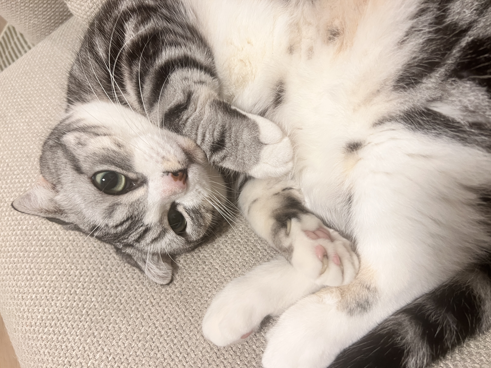

# Skills Pet macOS

一个用 `Swift + AppKit` 写的原生 macOS 桌宠项目。

它当前是一个轻量、可运行、可继续扩展的桌宠原型：透明悬浮窗、拖拽交互、状态栏入口、右键菜单、多姿态切换，以及基础动画细节都已经打通。



## Overview

- 原生 `AppKit` 实现，不依赖 Storyboard
- 透明无边框悬浮窗，跨 Space 显示
- 支持拖拽、双击、右键菜单、状态栏菜单
- 包含 `walk`、`sleep`、`sit`、`loaf`、`recline` 等姿态
- 可自动打开本地 `Skills Hub` / `Skills Catalog`

## Features

- `NSPanel` 浮动窗口与可见性守护
- 拖拽跟随与释放后的惯性回弹
- 逐帧精灵动画与状态切换
- 眨眼、尾巴摆动、耳朵 twitch、拉伸等细节动作
- 本地 HTML 页面自动发现与兜底生成
- Xcode 工程和命令行构建脚本两套启动方式

## Preview Assets

- GitHub 预览图：`docs/assets/github-preview.jpg`
- 桌宠精灵图：`cat-sprites/`
- 原始参考素材：`cat-picture/`

## Project Structure

```text
.
├── Sources/
│   ├── main.swift
│   ├── AppDelegate.swift
│   ├── PetWindow.swift
│   └── PetView.swift
├── SkillsPetLite.xcodeproj/
├── SkillsPetLite/
├── cat-sprites/
├── cat-picture/
├── docs/
│   ├── assets/
│   └── releases/
├── scripts/
├── LICENSE
├── RELEASING.md
└── launch.command
```

## Getting Started

### Open with Xcode

```bash
open SkillsPetLite.xcodeproj
```

或者直接双击：

```text
launch.command
```

### Build from script

```bash
bash scripts/build.sh
```

默认产物：

```text
build/SkillsPetLite.app
build/SkillsPetLite-bin
```

## Interaction

- 拖拽：移动桌宠
- 双击：打开本地 `Skills Hub`
- 右键：打开快捷菜单
- 状态栏菜单：显示桌宠、居中桌宠、打开 Hub / Catalog、退出

## Local Integration

程序会优先尝试读取：

- `skills_hub.html`
- `skills_catalog.html`

如果没有找到，会在下面这个目录生成一个基础版本：

```text
~/Library/Caches/SkillsPetLite/
```

精灵图默认读取目录：

```text
~/Desktop/skills-pet-macos/cat-sprites
```

如果磁盘路径不可用，程序会自动回退到 App Bundle 资源。

## Tech Stack

- Swift
- AppKit
- Xcode
- Shell

## Release

- 首个发布说明：`docs/releases/v0.1.0.md`
- 发布流程说明：`RELEASING.md`

## Known Limitations

- 仅支持 macOS
- 当前仍是原型版本
- 部分本地 Hub / Catalog 功能依赖本机文件结构
- 老版本 Xcode 或 Command Line Tools 可能需要额外调整

## License

This project is licensed under the MIT License. See `LICENSE`.
